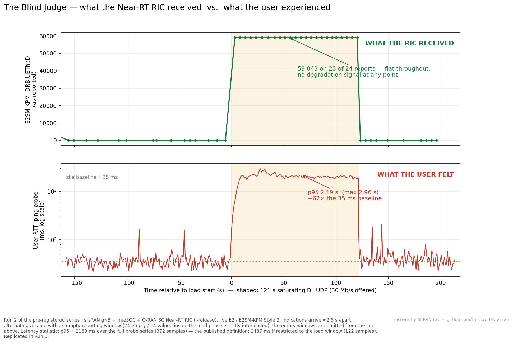
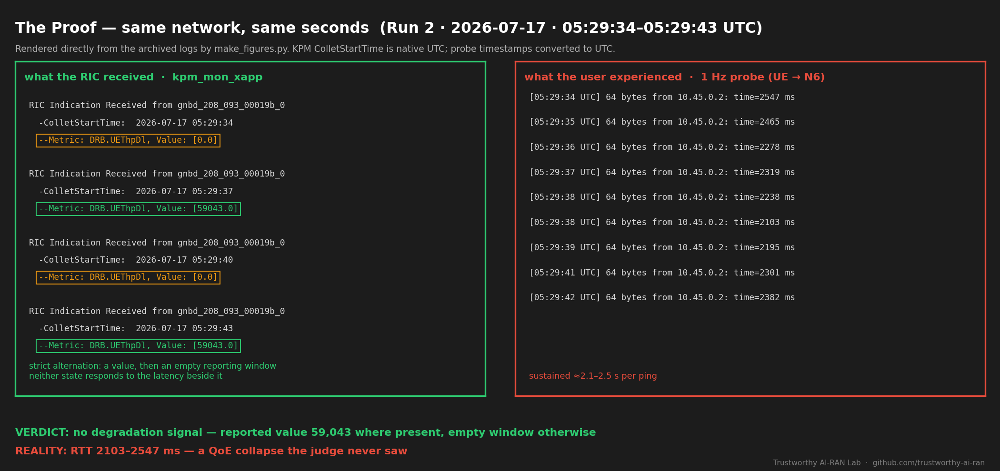

# Trustworthy AI-RAN Lab

An independent, fully open-source research testbed investigating a simple question with large consequences for autonomous networks:

> **Does the AI in the loop know what it cannot see — or does it confidently judge from insufficient telemetry?**

Everything here runs on one Ubuntu 22.04 VM, end-to-end open source: **free5GC** (5G SA core) · **srsRAN Project** (gNB + UE over ZMQ virtual radio) · **O-RAN SC Near-RT RIC** (i-release, live E2 / E2SM-KPM).

---

## UC-06 — "The Blind Judge"

**Finding.** On a live O-RAN E2 interface, a saturating downlink load drove user RTT from ≈40 ms to **p95 ≈ 2.1–2.2 s (max 2.96 s) — a ~50× QoE collapse — while the standard KPM metric `DRB.UEThpDl`, received as live RIC Indications by a monitoring xApp, reported a steady, healthy value for the entire load phase.** Zero degradation signal. The discriminator (a ≈6.17 MB standing queue, `rlc queue_size_bytes`) exists in the gNB's DU-local telemetry — on the wrong side of the E2 interface.



**Method.** Pre-registered A/B/A protocol (hypothesis locked in writing before any data): 60 s idle → 120 s saturating DL UDP (30 Mb/s offered) → 60 s recovery, with two independent witnesses recorded end-to-end — every RIC Indication (xApp log) and a 1 Hz timestamped ICMP probe from the UE. Full protocol: [`uc06-blind-judge/METHOD.md`](uc06-blind-judge/METHOD.md).

**Run accounting (full disclosure).**

| Run | Status | Headline |
|---|---|---|
| 1 | Voided | Procedural fault (probe suspended before writing any sample); reported as voided per protocol |
| 2 | Valid | 372 probe samples · p50 42.8 ms · **p95 2,189 ms** · max 2,956 ms |
| 3 | Valid | 435 probe samples · p50 39.9 ms · **p95 2,125 ms** · max 2,637 ms |

p95 of the two valid runs agree within 3%.

**Time-aligned proof** (verbatim log excerpts, same seconds):



**Why it matters.**
- KPM-green ≠ healthy: any AI agent fed only the standard E2 stream — threshold xApp or LLM copilot — classifies this network as fine.
- A digital twin fed by the same telemetry inherits the blindness and validates the disaster as safe.
- Latency tools exist (TWAMP, QoS monitoring) — but nothing in the loop knows *when* to invoke them; the trigger itself depends on the blind feed.
- The observability gap is implementation-independent evidence for DU-local intelligence (the **dApp** direction — Lacava et al., *Computer Networks* 269, 2025, [doi:10.1016/j.comnet.2025.111342](https://doi.org/10.1016/j.comnet.2025.111342)): their case is *access*; this experiment adds *sufficiency*.

**Repository contents.**

```
uc06-blind-judge/
├── METHOD.md      pre-registered protocol, testbed details, reproducibility notes
├── figures/       five publication figures (lab, architecture, data-flow, result, proof)
└── data/          raw timestamped probe log (Run 2) and the full KPM Indication log
```

Scope note: findings apply to the E2SM-KPM measurements exposed end-to-end by this stack (srsRAN gNB → O-RAN SC Near-RT RIC, i-release). Whether delay-class KPM measurements in newer spec revisions — where a stack implements them — close this gap is a planned follow-up ("observability atlas").

---

#

*Content licensed CC BY 4.0 — reuse with attribution.*
